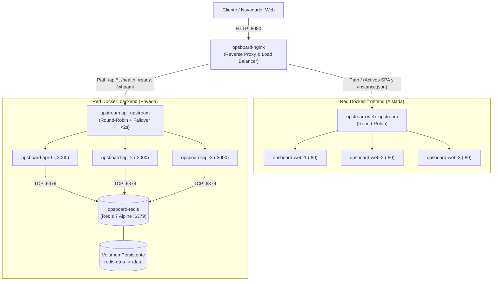
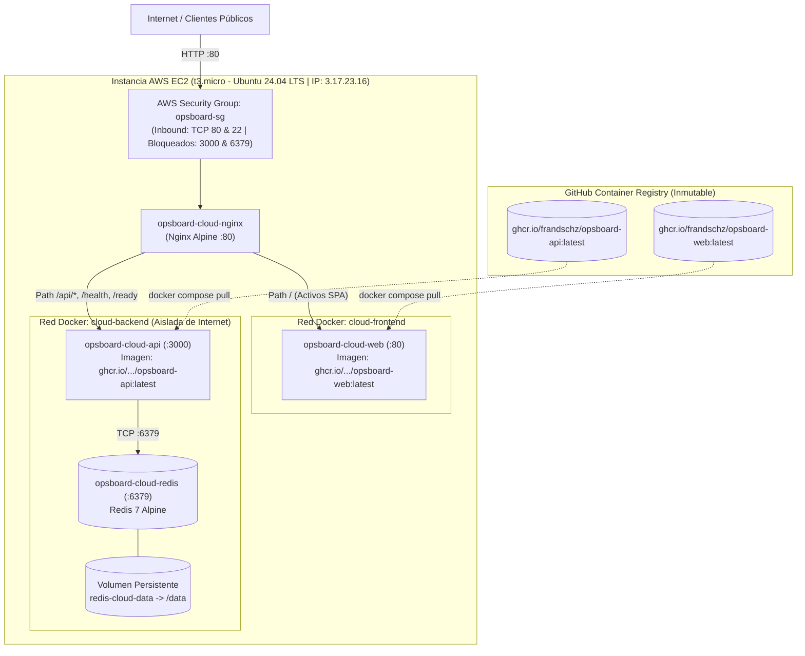
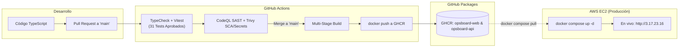

# OpsBoard

[](https://github.com/FranDSchz/devops-tp1/actions/workflows/ci.yml)
[](https://github.com/FranDSchz/devops-tp1/actions/workflows/security.yml)
[](https://github.com/FranDSchz/devops-tp1/actions/workflows/release-ghcr.yml)

[](http://3.17.23.16)

Trabajo Practico 1 de DevOps - UTN FRRe 2026.

> 🌐 **Despliegue Cloud en Producción (En vivo):** [http://3.17.23.16](http://3.17.23.16)  
> Stack orquestado con Docker Compose en AWS EC2 (Ubuntu 24.04 LTS), consumiendo artefactos inmutables publicados en GitHub Container Registry (GHCR) y protegido mediante Nginx reverse proxy y Security Groups.

OpsBoard es una aplicacion web contenerizada para registrar y gestionar incidentes de infraestructura. El objetivo central del proyecto es demostrar un flujo DevOps integral: contenedores, réplicas, balanceo con tolerancia a fallos, integración continua, análisis de seguridad (SAST/SCA), publicación inmutable de imágenes y despliegue en la nube.

## Estado

- **M0**: completado (documentacion, plantillas y organizacion inicial).
- **M1**: completado (aplicacion base: API, web y tests unitarios).
- **M2**: completado (contenedores, Nginx, tres replicas web y tres API, balanceo y tolerancia a fallos).
- **M3**: completado (CI, seguridad CodeQL/Trivy y Registry GHCR).
- **M4**: completado (despliegue en AWS EC2 desde GHCR y documentacion técnica consolidada).

La aplicacion es ejecutable localmente y en la nube: ver [Ejecucion local](#ejecucion-local-docker-compose) y [Despliegue en Cloud](#despliegue-en-cloud-aws-ec2).

Fecha de entrega indicada en la consigna: **lunes 14 de septiembre de 2026**.

## Alcance funcional minimo

- Crear un incidente.
- Listar los incidentes almacenados.
- Cambiar el estado de un incidente.
- Eliminar un incidente.
- Guardar y recuperar la informacion mediante Redis.

Cada incidente cuenta con atributos tipados: `id` (UUID), `title`, `service`, `severity`, `status`, `createdAt` y `updatedAt`.

## Arquitectura del Sistema

OpsBoard implementa una arquitectura desacoplada en microservicios contenerizados, aplicando el patrón **Dual-Homed Reverse Proxy**, **Defensa en Profundidad** y la política de **Same-Origin** (Zero CORS) mediante Nginx.

El proyecto cuenta con dos entornos de ejecución:
1. **Entorno Local (Desarrollo & Resiliencia Multi-Réplica):** Ejecuta 3 réplicas de Web, 3 réplicas de API, Redis con persistencia y Nginx balanceando con Round-Robin y conmutación automática ante fallos en menos de 2 segundos.
2. **Entorno Cloud (Producción en AWS EC2):** Ejecuta el stack productivo en una máquina virtual Linux en AWS consumiendo artefactos inmutables publicados en GitHub Container Registry (GHCR), protegido perimetralmente con Security Groups.

### 1. Topología Local Multi-Réplica (Alta Disponibilidad y Tolerancia a Fallos)



### 2. Topología Cloud en Producción (AWS EC2 + GHCR)



### 3. Pipeline de Entrega Continua y Despliegue Inmutable



La arquitectura completa con proxy y réplicas se ejecuta localmente mediante Docker Compose. En Cloud (AWS EC2), se ejecuta el stack productivo (`docker-compose.cloud.yml`) consumiendo exclusivamente las imágenes inmutables de GHCR.

## Decisiones tecnicas

| Area | Decision |
| --- | --- |
| Frontend | React, Vite y TypeScript |
| API | Fastify y TypeScript |
| Almacenamiento | Redis 7 Alpine con volumen persistente |
| Reverse proxy | Nginx con Round-Robin y Failover |
| Orquestacion local | Docker Compose |
| Tests | Vitest (31 pruebas unitarias aprobadas) |
| SAST | CodeQL oficial de GitHub |
| SCA y Secrets | Aqua Trivy |
| Registry | GitHub Container Registry (GHCR) |
| Despliegue Cloud | AWS EC2 (Ubuntu 24.04 LTS en t3.micro) con Docker Compose |
| Flujo de trabajo | GitHub Flow con protección de rama `main` |

## Organizacion del repositorio

El proyecto se desarrollara como monorepo:

```text
apps/
  web/
  api/
infrastructure/
  nginx/
  compose/
docs/
.github/
```

## Ejecucion local (Docker Compose)

Requisitos:

- Docker instalado.
- Docker Compose **v2** (comando `docker compose` con un espacio, no `docker-compose`).

Verificar la instalacion:

```bash
docker --version
docker compose version
```

Levantar el stack completo:

```bash
# Desde la raiz del repositorio
cd infrastructure/compose
docker compose up --build
```

La aplicacion queda disponible en <http://localhost:8080>. Nginx expone el unico puerto de entrada (`8080`) y balancea entre 3 nodos web y 3 nodos API.

- Redis se ejecuta en su propio contenedor con un volumen persistente.
- Cada nodo API responde el header `X-Instance-ID` y el endpoint `/health` devuelve la instancia que lo atendio (permite demostrar el balanceo).

Para detener el stack: `docker compose down` (agregar `-v` para borrar tambien el volumen de Redis).

### Demostrar el balanceo

Ver que distintas replicas API atienden cada peticion:

```bash
for i in {1..9}; do curl -s http://localhost:8080/health; echo; done
```

Se observan respuestas alternadas entre `api-1`, `api-2` y `api-3`.

### Demostrar tolerancia a la caida de una instancia

1. Detener una replica (por ejemplo `api-2`):

```bash
docker stop opsboard-api-2
```

2. Repetir las peticiones y comprobar que el servicio sigue respondiendo:

```bash
for i in {1..6}; do curl -s http://localhost:8080/health; echo; done
```

Solo responden las instancias activas (`api-1` y `api-3`).

3. Volver a levantar la instancia detenida:

```bash
docker start opsboard-api-2
```

Para inspeccionar los datos en Redis ver [cheatsheet-redis.md](docs/cheatsheet-redis.md).

## Despliegue en Cloud (AWS EC2)

La solución se encuentra desplegada y operativa en una máquina virtual Linux en AWS:

- **URL Pública (Acceso directo):** [http://3.17.23.16](http://3.17.23.16)
- **Infraestructura:** AWS EC2 `t3.micro` (Ubuntu 24.04 LTS, región Ohio `us-east-2`, Security Group `opsboard-sg` con puertos 22 y 80).
- **Inmutabilidad de Artefactos:** Despliegue mediante Docker Compose (`infrastructure/compose/docker-compose.cloud.yml`) consumiendo exclusivamente imágenes publicadas en GitHub Container Registry:
  - `ghcr.io/frandschz/opsboard-web:latest`
  - `ghcr.io/frandschz/opsboard-api:latest`
- **Endpoints de Diagnóstico y Salud:**
  - Frontend SPA: [http://3.17.23.16/](http://3.17.23.16/)
  - Healthcheck API: [http://3.17.23.16/health](http://3.17.23.16/health) (`{"status":"ok","instance":"api-cloud-1"}`)
  - Readiness (Redis ping): [http://3.17.23.16/ready](http://3.17.23.16/ready)
  - Frontend Instance: [http://3.17.23.16/instance.json](http://3.17.23.16/instance.json) (`{"instance":"web-cloud-1"}`)
  - API REST Incidentes: [http://3.17.23.16/api/incidents](http://3.17.23.16/api/incidents)
- Para más detalles sobre el aprovisionamiento, firewall y runbook operativo, ver [docs/cloud-deployment.md](docs/cloud-deployment.md).

## Colaboracion

- Cada cambio comienza con un Issue.
- Cada Issue se implementa en una rama corta.
- Los cambios ingresan a `main` mediante Pull Request.
- Cada Pull Request necesita revision de al menos otro integrante.
- `main` debe mantenerse en estado estable.
- Todos los integrantes deben comprender la arquitectura completa para el coloquio.

Consultar [CONTRIBUTING.md](CONTRIBUTING.md) antes de comenzar una tarea.

## Documentacion

- [Requisitos y criterios de evaluacion](docs/requirements.md)
- [Arquitectura del sistema](docs/architecture.md)
- [Decisiones del proyecto](docs/decisions.md)
- [Roadmap de entregas](docs/roadmap.md)
- [Estrategia y casos de pruebas unitarias](docs/tests.md)
- [Estrategia de seguridad, SAST y SCA](docs/security.md)
- [Publicacion y uso de imagenes en GHCR](docs/registry.md)
- [Procedimiento de despliegue en Cloud (AWS EC2)](docs/cloud-deployment.md)
- [Evidencias de balanceo, tolerancia a fallos y Redis](docs/evidencia-m2.md)
- [Cheatsheet de consultas y operaciones en Redis](docs/cheatsheet-redis.md)
- [Guion de demostracion y machete del coloquio](docs/guion-coloquio.md)
- [Informe tecnico de entrega](docs/report.md)

## Entregables previstos

- Aplicacion funcionando durante el coloquio.
- Repositorio grupal publico.
- Imagenes publicadas en GHCR mediante GitHub Actions.
- Aplicacion desplegada en un servicio cloud desde el Registry.
- Informe o presentacion con resultados, dificultades y mejoras futuras.
- Demostracion de Redis, balanceo y tolerancia a la caida de una instancia.

