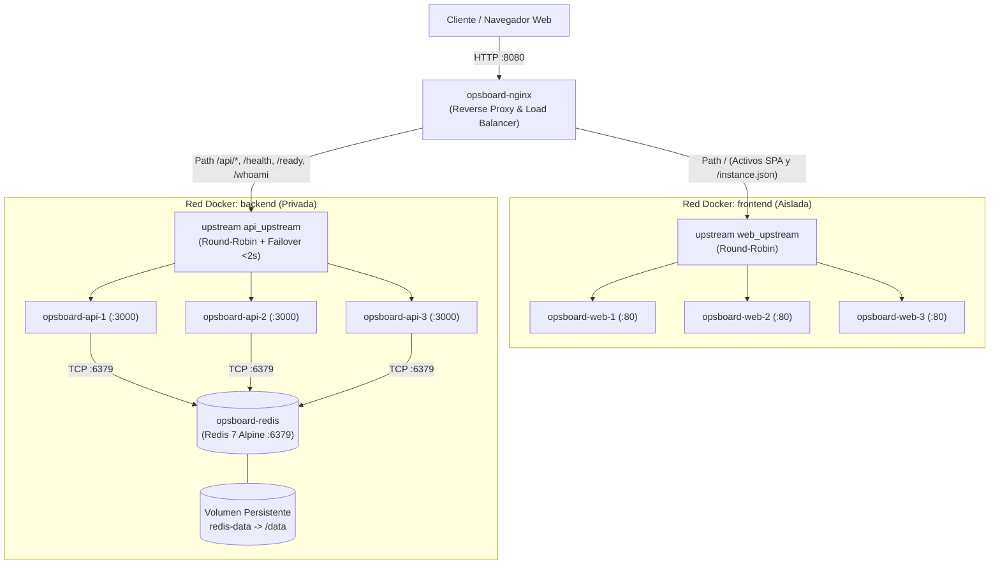
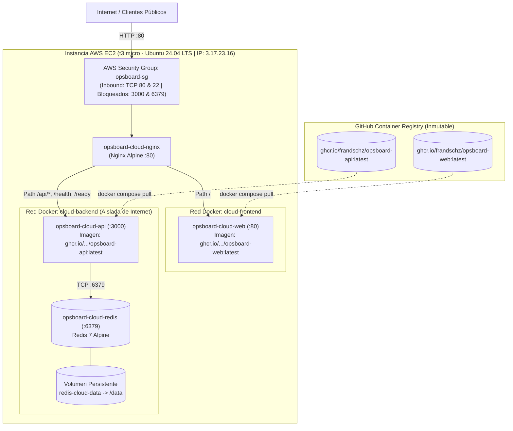

# Arquitectura del Sistema (OpsBoard)

## 1. Objetivo y Principios de Diseño

La arquitectura de **OpsBoard** está diseñada para demostrar un ciclo de vida DevOps integral: desacoplamiento de microservicios, contenerización estandarizada, balanceo de carga con tolerancia activa a fallos, integración continua, aseguramiento de la calidad mediante SAST/SCA, y despliegue inmutable en la nube desde un registro de contenedores.

### Principios de Ingeniería Aplicados

1. **Punto Único de Entrada y Mismo Origen (Zero CORS):**  
   Nginx actúa como fachada perimetral única (puerto `8080` local, puerto `80` en cloud). Al consolidar los activos estáticos del frontend (`/`) y los endpoints de la API REST (`/api/`) bajo el mismo origen, el navegador aplica la **Same-Origin Policy** de forma natural. Esto elimina el overhead de latencia de las peticiones pre-flight (`HTTP OPTIONS`), previene políticas CORS inseguras (`Access-Control-Allow-Origin: *`) y simplifica la seguridad.

2. **Dual-Homed Reverse Proxy y Defensa en Profundidad:**  
   Se implementa el patrón **Dual-Homed Proxy**: Nginx es el único contenedor conectado simultáneamente a la red perimetral (`frontend`) y a la red de servicios (`backend`). Redis queda confinado en la red privada `backend`, sin pasarela hacia el host (`ports` omitido deliberadamente) ni visibilidad desde los contenedores web, minimizando la superficie de ataque perimetral al mínimo privilegio indispensable.

3. **Microservicios Stateless:**  
   Los nodos de la API no conservan estado en memoria de proceso; cualquier réplica puede procesar cualquier solicitud leyendo y persistiendo directamente en Redis.

4. **Inmutabilidad y Paridad Dev/Prod (Twelve-Factor App):**  
   En producción, la máquina virtual no compila código ni instala dependencias de desarrollo. Consume imágenes inmutables preconstruidas y publicadas en **GitHub Container Registry (GHCR)** mediante pipelines automatizados. Las variaciones de entorno se gestionan exclusivamente mediante variables inyectadas en tiempo de ejecución.

---

## 2. Topología Local de Desarrollo y Alta Disponibilidad

El entorno local orquestado mediante `infrastructure/compose/docker-compose.yml` implementa una topología multi-réplica con Nginx balanceando solicitudes entre 3 nodos Web y 3 nodos API.



---

## 3. Topología Cloud en Producción (AWS EC2 + GHCR)

El entorno cloud opera sobre una máquina virtual **AWS EC2 (Ubuntu 24.04 LTS)** en la región `us-east-2` (Ohio), con acceso público a través de la IP `3.17.23.16`.



---

## 4. Responsabilidades de los Componentes

### 4.1. Aplicación Web (`apps/web`)
* **Stack:** React 19, TypeScript, Vite, empaquetada en servidor web Nginx alpine.
* **Función:** Interfaz reactiva para visualización, creación, avance de ciclo de vida (`open` $\to$ `in_progress` $\to$ `resolved` $\to$ `closed`) y eliminación de incidentes.
* **Desacoplamiento:** Consume la API exclusivamente bajo la ruta relativa `/api`, sin dependencias cruzadas de hostname ni exposición de puertos de base de datos.
* **Trazabilidad:** Expone `/instance.json` para reflejar qué réplica web sirvió la aplicación.

### 4.2. API REST (`apps/api`)
* **Stack:** Fastify 5, TypeScript.
* **Función:** Validación estricta de esquemas, lógica de negocio y mediación con Redis.
* **Endpoints de Diagnóstico y Salud:**
  * `GET /health`: Estado del proceso y retorno del identificador de réplica (`{"status":"ok","instance":"<ID>"}`).
  * `GET /ready`: Diagnóstico de dependencia externa mediante `redis.ping()`; devuelve `HTTP 200` si Redis responde `PONG` y `HTTP 503` en caso de fallo.
  * `GET /whoami`: Identificador de instancia activa.
* **Trazabilidad:** Inyecta en cada respuesta el encabezado HTTP `X-Instance-ID`.

### 4.3. Motor de Persistencia (`Redis 7 Alpine`)
* **Función:** Almacenamiento clave-valor estructurado para el estado compartido de los incidentes.
* **Modelo de Datos:**
  * **Hash (`incident:<id>`):** Atributos tipados del incidente (`id`, `title`, `service`, `severity`, `status`, `createdAt`, `updatedAt`).
  * **Set (`incidents`):** Índice global de identificadores para listado eficiente en complejidad predecible ($O(N)$ del set con `SMEMBERS`), evitando el comando antipatrón bloqueante `KEYS *`.
* **Durabilidad:** Modo `appendonly yes` vinculado a volumen persistente nombrado (`redis-data` en local, `redis-cloud-data` en cloud).

### 4.4. Proxy Inverso y Balanceador de Carga (`Nginx`)
* **Función:** Punto perimetral de contacto, enrutamiento por prefijo de ruta, balanceo de carga Round-Robin y conmutación por error.
* **Resiliencia y Failover:**
  * `proxy_next_upstream error timeout http_502;`: Si una réplica falla o es detenida, Nginx redirige la solicitud en vuelo hacia un nodo alternativo en menos de 2 segundos de manera imperceptible para el usuario.
  * `proxy_pass_header X-Instance-ID;`: Retransmite el identificador del backend al cliente para auditoría y demostración.
  * `resolver 127.0.0.11 valid=10s ipv6=off;`: Resolución dinámica de DNS interna de Docker para prevenir errores de IP estática ante recreación de contenedores.

---

## 5. Demostración de Balanceo y Tolerancia a Fallos

1. **Comprobación de Balanceo:**  
   Peticiones consecutivas a `/health` alternan cíclicamente entre los nodos disponibles:
   ```bash
   for i in {1..6}; do curl -s http://localhost:8080/health; echo ""; done
   ```
   *Salida esperada:* Respuestas alternadas entre `api-1`, `api-2` y `api-3`.

2. **Simulación de Caída de Réplica:**
   ```bash
   docker stop opsboard-api-2
   for i in {1..4}; do curl -s http://localhost:8080/health; echo ""; done
   ```
   *Resultado:* El servicio continúa 100% disponible respondiendo desde `api-1` y `api-3`, sin registrar errores `502 Bad Gateway`.

3. **Restauración:**
   ```bash
   docker start opsboard-api-2
   ```

---

## 6. Fuera de Alcance Inicial y Evolución

* Autenticación y gestión de usuarios (fuera del alcance del TP1).
* Clúster Redis Sentinel / Redis Cluster (se propone en el informe como mejora futura).
* Orquestadores complejos (Kubernetes / ECS) ya que Docker Compose resuelve el 100% de la consigna con mínima sobrecarga.

