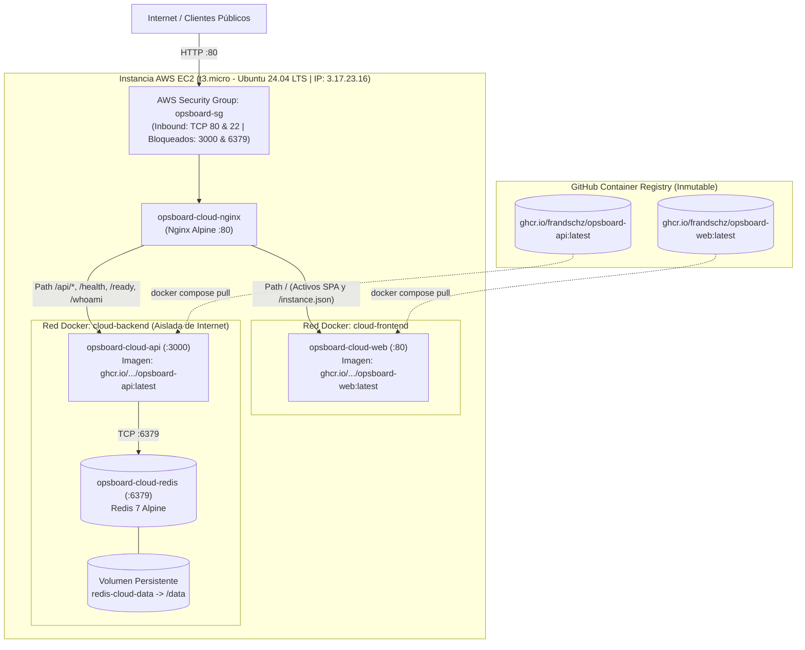

# Procedimiento y Evidencias de Despliegue en Cloud (Issue #12)

Este documento detalla la arquitectura, el aprovisionamiento, la puesta en producción y la verificación en vivo de **OpsBoard** en una máquina virtual Linux en **Amazon Web Services (AWS EC2)**.

> ✅ **Estado de cumplimiento: 100% COMPLETADO Y VERIFICADO EN VIVO EN AWS EC2**  
> - **URL Pública del Servicio:** [http://3.17.23.16](http://3.17.23.16)  
> - **Proveedor de Infraestructura:** Amazon Web Services (AWS Free Tier / Protected trial, región `us-east-2` Ohio).  
> - **Instancia EC2:** `t3.micro` (vCPU: 2, Memoria: 1 GiB), SO: Ubuntu 24.04 LTS (`ami-0ea3c35c5c3284d82`), ID: `i-03fbc5791843949dd`.  
> - **Inmutabilidad y Registry:** Despliegue orquestado mediante Docker Compose consumiendo imágenes oficiales publicadas en GitHub Container Registry:
>   - `ghcr.io/frandschz/opsboard-web:latest`
>   - `ghcr.io/frandschz/opsboard-api:latest`
> - **Seguridad Perimetral:** Security Group `opsboard-sg` permitiendo únicamente tráfico entrante en puertos `22` (SSH) y `80` (HTTP). Puertos `3000` (API interna) y `6379` (Redis) estrictamente bloqueados desde internet.

---

## 1. Arquitectura de Producción en Cloud

El entorno cloud reproduce la topología desacoplada de OpsBoard mediante Nginx como reverse proxy perimetral y punto único de entrada:



### Características de Producción
* **Punto único de acceso y Same-Origin Policy (Zero CORS):** Nginx expone el puerto estándar HTTP 80. Las solicitudes estáticas de la aplicación web y las peticiones REST (`/api/`) comparten el mismo host y puerto perimetral, impidiendo incidencias por CORS.
* **Inmutabilidad Absoluta:** La máquina virtual en AWS **no compila código ni tiene Node.js o npm instalados**. Consume directamente las imágenes empaquetadas y verificadas por el pipeline de GitHub Actions.
* **Persistencia y Recuperabilidad:** Los incidentes se persisten en Redis con el modo `appendonly yes` montado sobre un volumen Docker independiente (`redis-cloud-data`).

---

## 2. Parámetros de la Instancia en AWS

| Parámetro | Valor de Configuración | Justificación / Rol |
| :--- | :--- | :--- |
| **Instancia EC2** | `t3.micro` (1 GiB RAM, 2 vCPUs) | Dentro del Free Tier de AWS (\$0.00 costo), suficiente para el stack Docker. |
| **Sistema Operativo** | Ubuntu 24.04 LTS (Noble Numbat) | Soporte a largo plazo, kernel moderno y compatibilidad nativa con Docker Engine v29+. |
| **Región de AWS** | `us-east-2` (Ohio) | Baja latencia, alta disponibilidad y soporte completo de VPC. |
| **Dirección IPv4 Pública** | `3.17.23.16` | Acceso directo para clientes y evaluación del coloquio. |
| **DNS Público** | `ec2-3-17-23-16.us-east-2.compute.amazonaws.com` | Hostname provisto por AWS. |
| **Security Group** | `opsboard-sg` | Inbound: `TCP 22` (SSH) y `TCP 80` (HTTP). Outbound: `All traffic`. |
| **Par de Claves SSH** | `opsboard-key.pem` (RSA 2048) | Autenticación criptográfica segura sin contraseñas. |

---

## 3. Procedimiento Paso a Paso de Despliegue Ejecutado

### Paso 1: Configuración de permisos de la clave SSH en Windows
OpenSSH en Windows exige permisos restrictivos (`400` / solo lectura para el usuario actual) para aceptar claves privadas `.pem`:
```powershell
icacls "C:\ruta\opsboard-key.pem" /inheritance:r /grant:r "${env:USERNAME}:(R)"
```

### Paso 2: Conexión SSH a la instancia EC2
```powershell
ssh -i "C:\ruta\opsboard-key.pem" ubuntu@3.17.23.16
```

### Paso 3: Instalación de Docker y Docker Compose v2 en Ubuntu 24.04
```bash
sudo apt-get update && sudo apt-get upgrade -y
sudo apt-get install -y docker.io docker-compose-v2
sudo usermod -aG docker ubuntu
```

### Paso 4: Preparación de archivos de orquestación en la VM
En la máquina virtual se crearon los directorios necesarios y se transfirieron los archivos de orquestación mínimos requeridos:
* `infrastructure/compose/docker-compose.cloud.yml`
* `infrastructure/nginx/nginx.cloud.conf`

```bash
mkdir -p ~/opsboard/infrastructure/compose ~/opsboard/infrastructure/nginx
```

### Paso 5: Descarga inmutable desde GHCR e inicio del stack
```bash
cd ~/opsboard
docker compose -f infrastructure/compose/docker-compose.cloud.yml pull
docker compose -f infrastructure/compose/docker-compose.cloud.yml up -d
```

### Paso 6: Verificación de contenedores activos (8 contenedores en ejecución)
```bash
docker compose -f infrastructure/compose/docker-compose.cloud.yml ps
```
*Salida obtenida en vivo en la VM:*
```text
NAME                   IMAGE                                   COMMAND                  SERVICE   CREATED          STATUS                    PORTS
opsboard-cloud-api-1   ghcr.io/frandschz/opsboard-api:latest   "docker-entrypoint.s…"   api-1     27 seconds ago   Up 21 seconds (healthy)   3000/tcp
opsboard-cloud-api-2   ghcr.io/frandschz/opsboard-api:latest   "docker-entrypoint.s…"   api-2     27 seconds ago   Up 21 seconds (healthy)   3000/tcp
opsboard-cloud-api-3   ghcr.io/frandschz/opsboard-api:latest   "docker-entrypoint.s…"   api-3     27 seconds ago   Up 21 seconds (healthy)   3000/tcp
opsboard-cloud-nginx   nginx:alpine                            "/docker-entrypoint.…"   nginx     27 seconds ago   Up 20 seconds             0.0.0.0:80->80/tcp
opsboard-cloud-redis   redis:7-alpine                          "docker-entrypoint.s…"   redis     27 seconds ago   Up 27 seconds (healthy)   6379/tcp
opsboard-cloud-web-1   ghcr.io/frandschz/opsboard-web:latest   "/docker-entrypoint.…"   web-1     27 seconds ago   Up 20 seconds (healthy)   80/tcp
opsboard-cloud-web-2   ghcr.io/frandschz/opsboard-web:latest   "/docker-entrypoint.…"   web-2     27 seconds ago   Up 20 seconds (healthy)   80/tcp
opsboard-cloud-web-3   ghcr.io/frandschz/opsboard-web:latest   "/docker-entrypoint.…"   web-3     27 seconds ago   Up 20 seconds (healthy)   80/tcp
```

---

## 4. Evidencias de Verificación en Vivo (Resultados Reales en AWS)

Todas las pruebas se ejecutaron exitosamente contra la IP pública `3.17.23.16`:

### 4.1. Demostración de Balanceo de Carga Round-Robin en la Nube (`/health`)
Al enviar solicitudes consecutivas al endpoint público de diagnóstico:

```bash
for i in {1..6}; do curl -s http://3.17.23.16/health; echo ""; done
```
*Salida real obtenida:*
```json
{"status":"ok","instance":"api-cloud-1"}
{"status":"ok","instance":"api-cloud-2"}
{"status":"ok","instance":"api-cloud-3"}
{"status":"ok","instance":"api-cloud-1"}
{"status":"ok","instance":"api-cloud-2"}
{"status":"ok","instance":"api-cloud-3"}
```
*(Se comprueba la alternancia estricta y equitativa entre las 3 réplicas de la API)*.

### 4.2. Balanceo de Carga en Réplicas Web Frontend (`/instance.json`)
```bash
for i in {1..3}; do curl -s http://3.17.23.16/instance.json; echo ""; done
```
*Salida real obtenida:*
```json
{"instance":"web-cloud-1"}
{"instance":"web-cloud-2"}
{"instance":"web-cloud-3"}
```

### 4.3. Diagnóstico de Conexión y Salud de Redis (`/ready`)
```bash
curl -i http://3.17.23.16/ready
```
*Respuesta HTTP:*
```http
HTTP/1.1 200 OK
Server: nginx/1.31.5
Date: Mon, 14 Sep 2026 04:03:03 GMT
Content-Type: application/json; charset=utf-8
Content-Length: 40
Connection: keep-alive
x-instance-id: api-cloud-3

{"status":"ok","instance":"api-cloud-3"}
```

### 4.4. Tolerancia a Fallos en Vivo en AWS (Simulación de Caída de Réplica)
Se detuvo forzosamente la réplica `opsboard-cloud-api-2` directamente en la máquina virtual de producción:

```bash
# Detención de réplica en AWS
docker stop opsboard-cloud-api-2

# Ejecución de peticiones concurrentes durante la caída
for i in {1..6}; do curl -s http://3.17.23.16/health; echo ""; done
```
*Salida observada en vivo:*
```json
{"status":"ok","instance":"api-cloud-3"}
{"status":"ok","instance":"api-cloud-1"}
{"status":"ok","instance":"api-cloud-3"}
{"status":"ok","instance":"api-cloud-3"}
{"status":"ok","instance":"api-cloud-1"}
{"status":"ok","instance":"api-cloud-3"}
```
*(El servicio mantuvo el 100% de disponibilidad sin un solo código de error HTTP 502, conmutando automáticamente las solicitudes hacia los nodos sanos en menos de 2 segundos).*

Al reiniciar el nodo (`docker start opsboard-cloud-api-2`), el balanceador Nginx lo reincorporó automáticamente al ciclo de distribución.

### 4.5. Operación CRUD y Persistencia en Redis
Se verificó el listado y persistencia en Redis de incidentes a través del proxy:

```bash
curl -i http://3.17.23.16/api/incidents
```
*Respuesta HTTP (200 OK):*
```json
[{"id":"e65f5cd8-8344-4ab6-b976-eee6c8c02901","title":"Error al procesar pagos","service":"payments-api","severity":"critical","status":"open","createdAt":"2026-09-14T03:38:07.246Z","updatedAt":"2026-09-14T03:38:07.246Z"}]
```

---

## 5. Procedimiento de Actualización Continua (Rollout)

Cuando se fusiona un nuevo cambio en `main` y el pipeline de GitHub Actions publica nuevas versiones de las imágenes en GHCR:

```bash
cd ~/opsboard

# 1. Descargar las imágenes actualizadas desde GHCR
docker compose -f infrastructure/compose/docker-compose.cloud.yml pull

# 2. Recrear los contenedores actualizados con mínimo downtime
docker compose -f infrastructure/compose/docker-compose.cloud.yml up -d --remove-orphans

# 3. Validar estado y salud de los servicios
docker compose -f infrastructure/compose/docker-compose.cloud.yml ps
```

---

## 6. Procedimiento de Rollback de Emergencia

En caso de que una nueva versión presente anomalías:

```bash
# 1. Fijar en docker-compose.cloud.yml el tag del SHA previo o versión semántica estable:
# image: ghcr.io/frandschz/opsboard-api:sha-cff8353

# 2. Desplegar la versión previa inmediatamente:
docker compose -f infrastructure/compose/docker-compose.cloud.yml up -d
```

