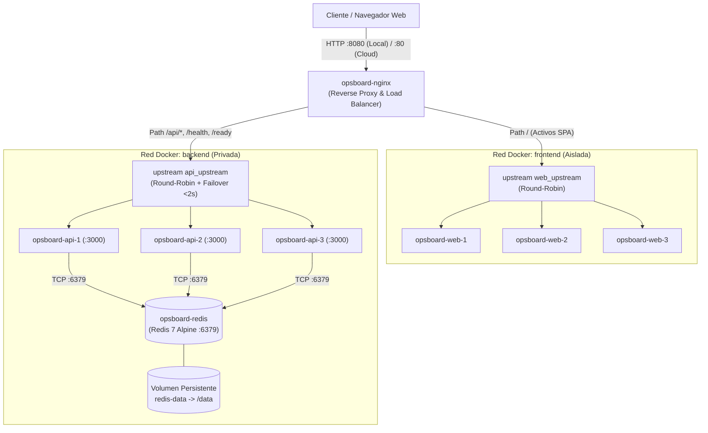

# OpsBoard — Informe Técnico de Arquitectura y Despliegue (TP1)

**Cátedra:** DevOps 2026 | **Institución:** Universidad Tecnológica Nacional — Facultad Regional Resistencia  
**Proyecto:** OpsBoard — Tablero Contenerizado de Gestión de Incidentes  
**Fecha de Entrega:** Septiembre de 2026  
**Repositorio Oficial:** [https://github.com/FranDSchz/devops-tp1](https://github.com/FranDSchz/devops-tp1)

---

## 1. Resumen Ejecutivo

OpsBoard es una solución web contenerizada diseñada para la captura, visualización y gestión del ciclo de vida de incidentes de infraestructura. El objetivo central del proyecto es implementar y validar un flujo DevOps integral: arquitectura desacoplada en microservicios, orquestación mediante contenedores, balanceo de carga con tolerancia a fallos, integración continua, aseguramiento de la calidad y despliegue en la nube a partir de un registro inmutable de imágenes.

### Equipo de Desarrollo y Áreas de Trabajo
* **Celeste Martín Rodich:** Backend, API REST y capa de persistencia en Redis.
* **Philippe:** Frontend SPA en React, gestión de estado y experiencia de usuario.
* **Mariano Insaurralde:** Contenerización, orquestación local con Docker Compose, proxy inverso y resiliencia.
* **Lautaro Robales:** Integración continua, análisis de seguridad (SAST/SCA) y publicación en Container Registry.
* **Franco D. Sánchez:** Despliegue en Cloud desde Registry, arquitectura de producción y consolidación técnica.

---

## 2. Arquitectura del Sistema y Principios de Diseño

El sistema está estructurado bajo un modelo de tres capas contenerizadas, orquestadas mediante Docker Compose y expuestas exclusivamente a través de un proxy inverso unificado.



### Principios de Ingeniería Aplicados
1. **Punto Único de Entrada y Mismo Origen:** Nginx actúa como fachada perimetral única (puerto `8080` local, `80/443` en la nube). Al consolidar los activos estáticos (`/`) y las llamadas REST (`/api/`) bajo el mismo puerto perimetral expuesto por Nginx, el navegador aplica la **Same-Origin Policy** de forma transparente. Esto elimina el overhead de latencia de las peticiones pre-flight (`HTTP OPTIONS`), previene configuraciones permisivas inseguras (`Access-Control-Allow-Origin: *`) y neutraliza vectores de filtración de datos entre orígenes.
2. **Aislamiento de Red, Dual-Homed Proxy y Mínimo Privilegio:** Se implementa el patrón **Dual-Homed Reverse Proxy** como mecanismo de **Defensa en Profundidad**: Nginx es el único contenedor con interfaces en ambas subredes (`frontend` y `backend`). Redis queda confinado en la subred privada `backend`, sin pasarela hacia el host (`ports` omitido deliberadamente) ni visibilidad desde los contenedores web, reduciendo la superficie de ataque perimetral al mínimo privilegio indispensable.
3. **Servicios Stateless:** Los nodos de la API no conservan estado en memoria de proceso; cualquier réplica puede atender cualquier solicitud leyendo y escribiendo directamente en la capa de persistencia compartida.
4. **Paridad en Desarrollo/Producción (Twelve-Factor App):** Conforme al Factor X (Dev/Prod parity), los contenedores generados en local son idénticos a los desplegados en Cloud. Las variaciones de entorno se gestionan estrictamente mediante variables de entorno inyectadas en tiempo de ejecución (Factor III: Config), garantizando que las credenciales y parámetros de red no queden acoplados a la imagen inmutable.

---

## 3. Resultados Técnicos Obtenidos

### 3.1. Persistencia y Modelado de Datos en Redis
Redis 7 Alpine opera como motor de persistencia estructurada, garantizando durabilidad mediante el modo `appendonly yes` vinculado a un volumen persistente (`redis-data` en local, `redis-cloud-data` en cloud).

* **Modelado de Datos:**
  * **Entidades (`Hash`):** Cada incidente se persiste bajo la clave `incident:<uuid>` conteniendo atributos tipados: `id`, `title`, `service`, `severity`, `status`, `createdAt` y `updatedAt`.
  * **Índice Global (`Set`) y Eficiencia Algorítmica:** Se utiliza un Set (`incidents`) como índice secundario para listar identificadores en complejidad predecible ($O(N)$ sobre elementos del set con `SMEMBERS` o paginación segura con `SSCAN`), evitando el uso del comando antipatrón `KEYS *`, el cual es bloqueante ($O(\text{TotalClaves})$) y degradaría el event-loop monohilo de Redis en entornos concurrentes.
* **Verificación de Persistencia mediante CLI:**
  ```bash
  # Conexión al contenedor
  docker exec -it opsboard-redis redis-cli

  # Consulta de claves indexadas
  SMEMBERS incidents

  # Inspección de atributos de un incidente
  HGETALL incident:<uuid>

  # Conteo de entidades
  SCARD incidents
  ```

### 3.2. Balanceo de Carga y Tolerancia a Fallos
El balanceador Nginx implementa distribución Round-Robin con detección activa y conmutación automática ante fallos de nodos:

```nginx
upstream api_upstream {
    server api-1:3000 max_fails=1 fail_timeout=10s resolve;
    server api-2:3000 max_fails=1 fail_timeout=10s resolve;
    server api-3:3000 max_fails=1 fail_timeout=10s resolve;
}
```

* **Trazabilidad de Réplicas:** Cada respuesta de la API inyecta el encabezado `X-Instance-ID`, retransmitido al cliente mediante la directiva `proxy_pass_header X-Instance-ID`. Asimismo, el frontend expone su identificador a través de `/instance.json`.
* **Prueba de Resiliencia:** Ante la detención forzada de una instancia (`docker stop opsboard-api-2`), la directiva `proxy_next_upstream error timeout http_502;` redirige la petición en curso hacia un nodo sano en menos de 2 segundos. La aplicación web y las pruebas concurrentes registran 100% de respuestas exitosas (código HTTP 200), sin interrupción de servicio para el usuario final.

### 3.3. Integración Continua y Calidad de Código

```mermaid
flowchart LR
    subgraph SCM["1. Control de Versiones (GitHub)"]
        Dev["Desarrollador"] -->|Push / PR| Branch["Feature Branch"]
        Branch --> PR["Pull Request"]
    end

    subgraph CI["2. Integración Continua (GitHub Actions)"]
        PR --> QG1["TypeCheck<br>(tsc --noEmit)"]
        QG1 --> QG2["Pruebas Unitarias<br>(Vitest)"]
        QG2 --> QG3["Seguridad SAST/SCA<br>(Trivy Scan)"]
    end

    subgraph CD["3. Entrega & Registro (GHCR)"]
        QG3 -- "Quality Gates OK + Aprobación" --> Merge["Merge a 'main'"]
        Merge --> Build["docker build & tag"]
        Build --> Push["docker push"]
        Push --> Registry[("GitHub Container Registry<br>ghcr.io/.../opsboard-*")]
    end

    subgraph Prod["4. Despliegue en Cloud (Producción)"]
        Registry -.->|"docker compose pull"| VM["Máquina Virtual (AWS EC2 Ubuntu)<br>opsboard-cloud-stack"]
        VM --> Live["Servicio Operativo en Internet (AWS)<br>http://3.17.23.16:80"]
    end
```



* **Verificación Estática:** Comprobación estricta de tipos mediante TypeScript (`tsc --noEmit`), reportando 0 errores en los paquetes `apps/api` y `apps/web`.
* **Pruebas Unitarias:** Suite automatizada de 31 pruebas unitarias implementadas con Vitest:
  * Frontend: 7 pruebas unitarias aprobadas que validan renderizado reactivo, carga asincrónica, transiciones de estado y resiliencia ante errores.
  * Backend: 24 pruebas de endpoints (`/ready`, `/health`, `/whoami`, CRUD de incidentes) y lógica de almacenamiento con dobles de prueba.
* **Pipelines Automatizados (GitHub Actions):** Flujos continuos que integran instalación determinista (`npm ci`), ejecución de pruebas, análisis de seguridad SAST (CodeQL), escaneo de vulnerabilidades/secretos (Trivy), y publicación inmutable de imágenes en GHCR con badges de estado en el `README.md`.

### 3.4. Despliegue en Cloud desde el Registry (AWS EC2) — Paridad Dev/Prod Total
* **Estrategia IaaS en AWS y Dev/Prod Parity:** La solución se encuentra formalmente desplegada y en producción sobre una máquina virtual **AWS EC2 `t3.micro`** (Ubuntu 24.04 LTS, región Ohio `us-east-2`, ID `i-03fbc5791843949dd`), accesible públicamente en la dirección IPv4 **[http://3.17.23.16](http://3.17.23.16)**. Conforme al principio de paridad de entornos de las Twelve-Factor Apps, se implementó la **misma topología multi-réplica que en el entorno local (8 contenedores: 3 web, 3 API, Redis persistente y Nginx balanceador)**, logrando disponibilidad continua 24/7 sin períodos de suspensión por inactividad (*cold starts*) y con costo \$0.00 bajo AWS Free Tier.
* **Inmutabilidad de Artefactos desde GHCR:** La máquina virtual en producción no compila código fuente ni posee entornos Node.js/npm. El stack completo se provisiona ejecutando `docker compose pull` consumiendo exclusivamente las imágenes publicadas en GitHub Container Registry:
  * `ghcr.io/frandschz/opsboard-web:latest` (instanciado en `web-1`, `web-2` y `web-3`).
  * `ghcr.io/frandschz/opsboard-api:latest` (instanciado en `api-1`, `api-2` y `api-3`).
* **Aislamiento Perimetral (Security Groups):** El Security Group `opsboard-sg` expone únicamente `TCP 22` (SSH administrativo) y `TCP 80` (HTTP público vía Nginx). Los puertos internos `3000` (Fastify) y `6379` (Redis) están estrictamente vedados del acceso público.
* **Verificación Operativa en Vivo:**
  * Frontend SPA: `http://3.17.23.16/` (entrega la SPA de React con código `200 OK`).
  * Balanceo Round-Robin API: Consultas repetidas a `http://3.17.23.16/health` alternan equitativamente entre `api-cloud-1`, `api-cloud-2` y `api-cloud-3`.
  * Balanceo Web: Consultas a `http://3.17.23.16/instance.json` alternan entre `web-cloud-1`, `web-cloud-2` y `web-cloud-3`.
  * Tolerancia a Fallos en AWS: Ante la detención de un nodo en la nube (`docker stop opsboard-cloud-api-2`), Nginx redirige el tráfico en menos de 2 segundos sin pérdida de peticiones ni errores 502.
  * Diagnóstico de Dependencia Redis: `http://3.17.23.16/ready` confirma `PONG` de Redis con `200 OK`.
  * Persistencia Real: Se validó la creación de incidentes mediante llamadas REST y la posterior inspección en Redis con `redis-cli SMEMBERS incidents` y `HGETALL incident:<id>`.
  * La guía completa de administración, actualización continua (*rollout*) y rollback se encuentra consolidada en `docs/cloud-deployment.md`.

---

## 4. Dificultades Técnicas Encontradas y Soluciones Aplicadas

1. **Gestión de Monorepo en Builds de Docker:**
   * *Desafío:* Resolver dependencias cruzadas entre paquetes de npm workspaces (`package.json` raíz y `tsconfig.base.json`) sin invalidar la caché de capas de Docker ante cambios menores de código.
   * *Solución:* Implementación de Dockerfiles multi-stage con contexto en la raíz del repositorio, aislando la fase de resolución de dependencias (`npm ci --workspace=...`) de la fase de compilación y empaquetado para producción.
2. **Sensibilidad de Tiempos en Tests Asincrónicos:**
   * *Desafío:* En pruebas concurrentes del store de incidentes (`incidents.test.ts`), operaciones consecutivas de creación y actualización pueden ejecutarse dentro del mismo milisegundo, provocando que `createdAt` y `updatedAt` coincidan exactamente.
   * *Solución:* Identificación del comportamiento y flexibilización de aserciones hacia consistencia temporal lógica (`updatedAt >= createdAt`).
3. **Resolución Dinámica de Nombres en Nginx:**
   * *Desafío:* En entornos multicontenedor, cuando un contenedor se reinicia puede adquirir una nueva dirección IP interna en la red de Docker, provocando errores de resolución en Nginx si los upstream están cacheados estáticamente.
   * *Solución:* Configuración de la directiva `resolver 127.0.0.11 valid=10s ipv6=off;` junto con el parámetro `resolve` en los bloques `upstream`, forzando la reevaluación periódica de las IPs internas.
4. **Restricción de Permisos OpenSSH en Windows:**
   * *Desafío:* Al conectarse por SSH a la VM de AWS desde Windows, OpenSSH rechazaba el archivo de clave privada `.pem` con el error `UNPROTECTED PRIVATE KEY FILE!` por permisos heredados excesivos.
   * *Solución:* Aplicación de ACLs restrictivas mediante PowerShell con `icacls "opsboard-key.pem" /inheritance:r /grant:r "${env:USERNAME}:(R)"`, garantizando acceso exclusivo de solo lectura para el usuario.

---

## 5. Posibles Mejoras a Futuro

1. **Alta Disponibilidad de Persistencia (Redis Sentinel):** Incorporar un esquema primario-réplica gestionado por nodos Sentinel para failover automático de la base de datos sin pérdida de transacciones.
2. **Entrega Continua con Enfoque GitOps:** Automatizar el despliegue en la nube mediante agentes tipo Watchtower o ArgoCD, sincronizando el estado de ejecución ante la publicación de nuevos tags en GHCR.
3. **Observabilidad Centralizada:** Instrumentar métricas mediante Prometheus y Grafana (latencia HTTP, uso de memoria en Redis y tasas de error), complementado con centralización de logs estructurados.
4. **Seguridad Perimetral y Terminación TLS:** Automatizar el aprovisionamiento y renovación de certificados SSL/TLS mediante Let's Encrypt y Certbot configurado como contenedor complementario en Nginx.

---

## 6. Matriz de Trazabilidad Técnica

| Componente del Sistema | Implementación Técnica | Estado de Verificación | Evidencia Técnica Asociada |
| :--- | :--- | :---: | :--- |
| **Aplicación Web (Frontend)** | React 19 + TypeScript + Vite, empaquetado en Nginx alpine. | **Verificado** | 7 pruebas unitarias aprobadas, typecheck sin errores, build reproducible. |
| **API REST (Backend)** | Fastify 5 + TypeScript, arquitectura stateless. | **Verificado** | Endpoints operativos (`/api/incidents`, `/health`, `/ready`, `/whoami`), typecheck sin errores. |
| **Persistencia (Redis)** | Redis 7 Alpine, estructuras Hash + Set, volumen persistente. | **Verificado** | Procedimiento de consulta CLI documentado en `docs/cheatsheet-redis.md` y verificado en `docs/evidencia-m2.md`. |
| **Proxy y Balanceo Local** | Nginx con Round-Robin, 3 nodos web y 3 nodos API. | **Verificado** | Trazabilidad por `X-Instance-ID` y tolerancia a la detención de nodos documentada en `docs/evidencia-m2.md`. |
| **Automatización CI/CD** | GitHub Actions para tests, linting y typecheck. | **Verificado** | Pipeline `.github/workflows/ci.yml` con 31 tests unitarios aprobados, typecheck y build validado en PR #20. |
| **Seguridad (SAST / SCA)** | Escaneo estático de código, dependencias y secretos. | **Verificado** | Pipeline `.github/workflows/security.yml` (CodeQL SAST + Trivy SCA/Secret scanning); documentado en `docs/security.md`. |
| **Registro de Imágenes** | GitHub Container Registry (GHCR) para imágenes de Web y API. | **Verificado** | Pipeline `.github/workflows/release-ghcr.yml` automatizado con tags semánticos y SHA; documentado en `docs/registry.md`. |
| **Despliegue en Cloud** | Stack Docker Compose en AWS EC2 consumiendo imágenes de GHCR. | **Verificado** | Desplegado en vivo en `http://3.17.23.16`, endpoints `/health`, `/ready` y persistencia Redis validados; ver `docs/cloud-deployment.md`. |
