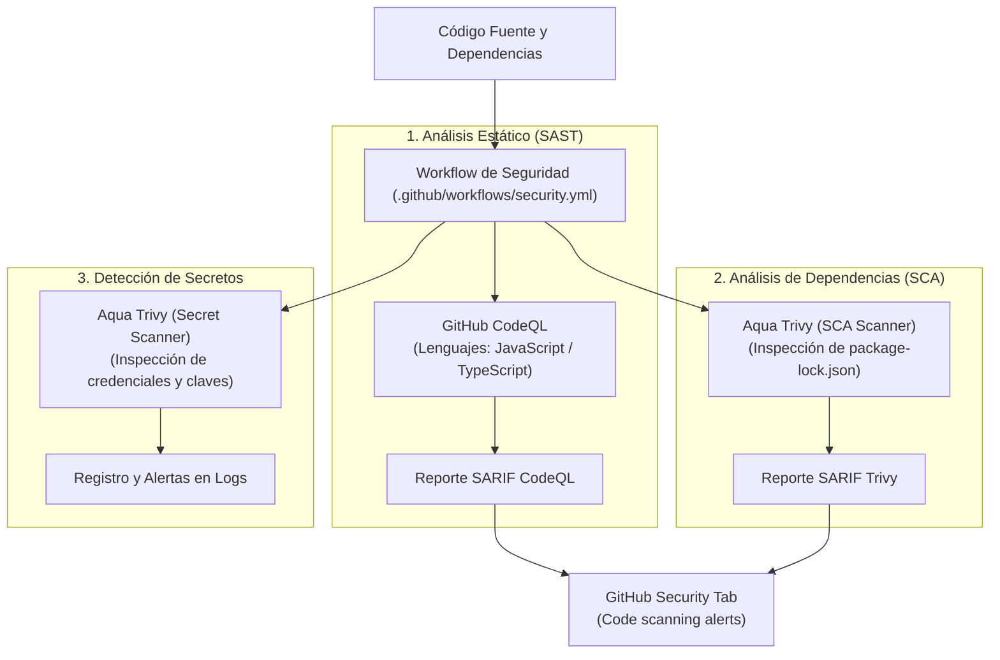

# Estrategia de Seguridad, SAST, SCA y Detección de Secretos (Issue #10)

Este documento detalla la política de seguridad, las herramientas automatizadas en el pipeline de CI/CD y los criterios de severidad implementados conforme a las consignas de la cátedra DevOps 2026.

---

## 1. Alcance y Arquitectura de Seguridad (DevSecOps)

El pipeline de seguridad (`.github/workflows/security.yml`) implementa tres capas de verificación continua sin costo de infraestructura externa:

---

## 2. Herramientas y Metodología

### 2.1. CodeQL (SAST — Static Application Security Testing)
* **Objetivo:** Detección de vulnerabilidades de código fuente (inyecciones, exposición de datos, validaciones incompletas).
* **Configuración:**
  * Motor oficial de GitHub: `github/codeql-action/init@v3` y `analyze@v3`.
  * Lenguaje objetivo: `javascript-typescript` (cubre `apps/api` y `apps/web`).
  * Integración nativa con la pestaña **Security > Code Scanning** del repositorio vía formato estándar SARIF.

### 2.2. Trivy (SCA — Software Composition Analysis)
* **Objetivo:** Escaneo del árbol de dependencias del monorepo (`package-lock.json`) contra bases de datos de vulnerabilidades conocidas (CVEs, NVD, GitHub Advisory Database).
* **Configuración:**
  * Acción: `aquasecurity/trivy-action`.
  * Tipo de escaneo: `fs` (Filesystem).
  * Salida estructurada: generación de archivo SARIF (`trivy-sca-results.sarif`) subido a la interfaz de seguridad de GitHub mediante `upload-sarif`.

### 2.3. Trivy (Detección de Secretos y Credenciales)
* **Objetivo:** Asegurar que ningún archivo o commit exponga contraseñas, tokens de API, certificados privados o variables sensibles.
* **Configuración:**
  * Chequeo activado: `security-checks: 'secret'`.
  * Salida tabular en el resumen del job de GitHub Actions para rápida auditoría.

---

## 3. Política de Severidad

| Nivel de Severidad | Criterio de Acción en Pipeline | Tiempo de Remediación |
| :--- | :--- | :--- |
| **CRITICAL** | **Bloqueante**. Impide el merge a `main` y la publicación de artefactos en GHCR. | Inmediato (Hotfix). |
| **HIGH** | **Bloqueante** en dependencias directas de producción. Notificación activa en PR. | Menor a 48 hs. |
| **MEDIUM / LOW** | No bloqueante. Se registran en el backlog de mantenimiento preventivo. | Próximo ciclo de mantenimiento. |

---

## 4. Auditoría y Resultados Locales Previos

1. **Dependencias del Monorepo:**
   * La ejecución previa de `npm audit` reporta 0 vulnerabilidades críticas o altas.
   * Existen únicamente 2 advertencias de severidad moderada en paquetes auxiliares de desarrollo, las cuales no afectan el runtime de producción.
2. **Secretos e Inmisiones:**
   * El archivo `.dockerignore` y `.gitignore` previenen la inclusión de archivos `.env`, carpetas de claves o `node_modules` en las imágenes y repositorios.
